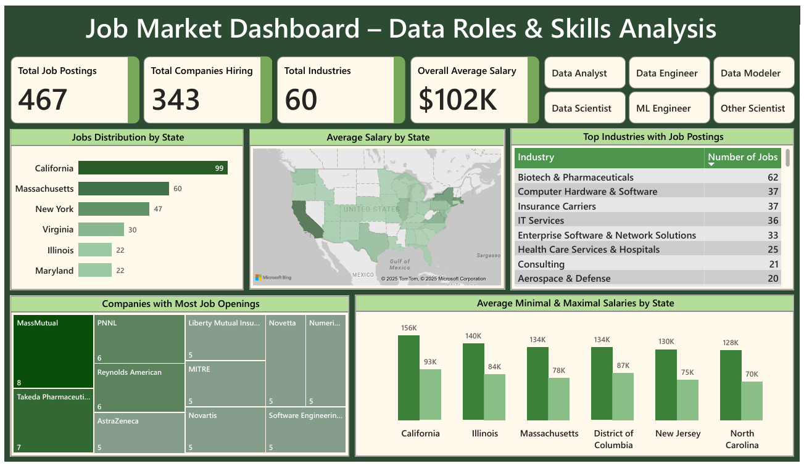
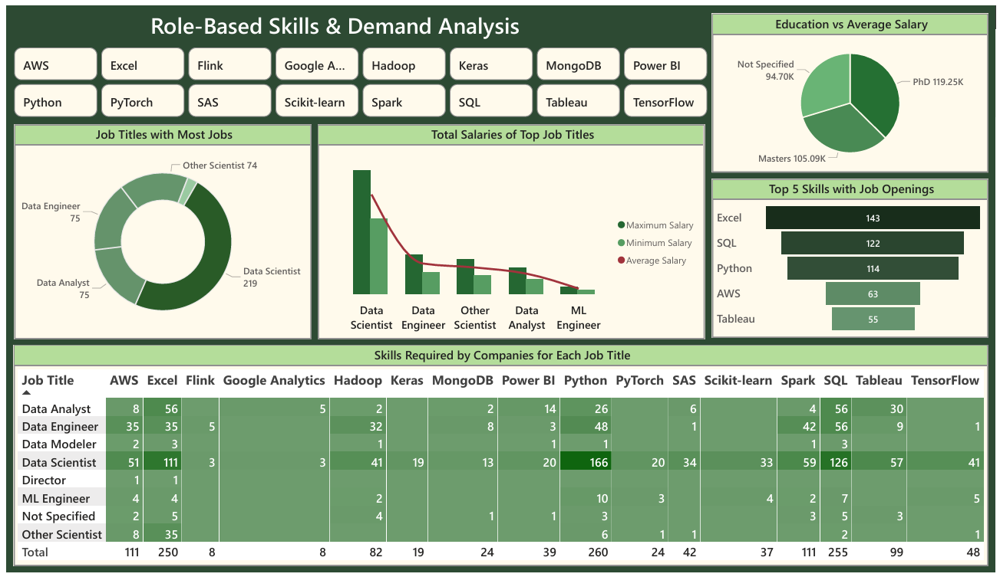

# Job Market Analysis Dashboard
**By Kirti Sundar Dey**  
📊 *Internship Project at  Rubixe – AI Solutions Company*

---

## 📝 Short Description  
An interactive **Power BI dashboard** powered by **SQL-based data analysis**, developed during my **internship at Rubixe – AI Solutions Company**.  
This project explores job market trends in various **data-related roles** and reveals insights about **in-demand skills, hiring industries, and salary patterns** across the U.S.

---

## 🏷️ Tags  
`#DataAnalysis` `#PowerBI` `#SQL` `#MySQLWorkbench` `#RubixeInternship`  
`#DataVisualization` `#DashboardProject` `#JobMarketAnalysis` `#DataScience`  
`#DataEngineer` `#DataAnalyst` `#SkillsInsights` `#BIProject`

---

## 📋 Project Overview  
This project was completed during my **internship at Rubixe – AI Solutions Company** as part of a hands-on assignment on **data analytics and visualization**.

Rubixe provided a **single database named `job_market_analysis`**, which contained **42 columns** with detailed job market information such as job titles, companies, locations, salaries, skills, and industries.

I performed the following steps:
1. **Extracted the raw data** from the [`job_market_analysis`](./RawData/job_market_analysis.csv) database.  
2. **Cleaned, standardized, and transformed** the dataset using **MySQL Workbench**.  
3. **Exported the cleaned dataset** into Power BI for visualization and analysis.  
4. **Built interactive dashboards** to identify market trends, top-paying roles, and in-demand skills.

The final dashboard helps understand hiring trends in the **Data Science & Analytics** domain and supports data-driven career insights.

---

## 🗂️ Project Workflow  

### 1. Database Overview  
- **Database Name:** [`job_market_analysis`](./RawData/job_market_analysis.csv)  
- **Total Columns:** 42  
- **Data Provided By:** Rubixe – AI Solutions Company

- **Data Includes:**  
  - Job Title  
  - Company Name  
  - State / Location  
  - Industry Type  
  - Required Skills  
  - Education Level  
  - Minimum / Maximum / Average Salary  
  - Number of Job Postings  

---

### 2. Data Preparation (MySQL Workbench)  
I used **MySQL Workbench** to extract, clean, and prepare the dataset.  

**Key Data Cleaning Steps:**  
- Removed duplicate and null records  
- Renamed and standardized inconsistent column names  
- Trimmed extra spaces and corrected data formats  
- Aggregated job data by **role, state, and skill**  
- Calculated **average, minimum, and maximum salaries**  
- Exported the cleaned dataset as a `.csv` file for Power BI visualization  

📄 **SQL Script Used:** [`data_preparation.sql`](./DataPreparation/data_preparation.sql)
📄 **Cleaned Data:** [`Data After Cleaning`](./CleanedData)

---

### 3. Dashboard Creation (Power BI)  
After cleaning and exporting the data, I used **Power BI** to create two dashboards:  
- **Page 1:** Job Market Overview  
- **Page 2:** Skills and Role Analysis  

Both dashboards include interactive visuals, KPIs, and charts to help explore job data trends effectively.

---

## 📊 Dashboard Details  

### 🟩 **Page 1: Job Market Overview**  
**Purpose:** Provide an overall summary of job postings, industries, and salary distributions.  

**Key Metrics:**  
- **Total Job Postings:** 467  
- **Companies Hiring:** 343  
- **Industries Covered:** 60  
- **Average Salary:** $102K  

**Highlights:**  
- **Top Hiring States:** California, Massachusetts, New York  
- **Top Industries:** Biotech & Pharmaceuticals, IT Services, Health Care  
- **Top Companies:** MassMutual, PNNL, Takeda Pharmaceuticals  
- **Highest Average Salary:** California ($156K)  

📸 *Dashboard Preview:*  

---

### 🟩 **Page 2: Skills & Role Analysis**  
**Purpose:** Analyze skills demand, education impact, and salary by job roles.  

**Key Insights:**  
- **Top Job Titles:**  
  - Data Scientist (219 openings)  
  - Data Engineer (75 openings)  
  - Data Analyst (75 openings)  
- **Top Skills:** Excel, SQL, Python, AWS, Tableau  
- **Education Impact:**  
  - PhD professionals earn the highest average salary $119K  
  - Master’s degree holders earn around $105K on average  
- **Highest Paying Roles:** Data Scientist & ML Engineer  

📸 *Dashboard Preview:*  

---

## 🧩 Tools & Technologies  
| Tool | Purpose |
|------|----------|
| **MySQL Workbench** | Data extraction, cleaning, and transformation |
| **SQL** | Data manipulation and aggregation |
| **Power BI** | Dashboard creation and visualization |
| **CSV** | Data export and inspection |

---

## 💡 Insights & Learnings  
- **California** dominates the data job market with the most postings and highest salaries.  
- **Excel, SQL, and Python** remain core skills across all data roles.  
- **Data Scientist** is both the most in-demand and best-paid role.  
- Education level directly impacts salary potential.  
- Learned how to **clean large datasets with MySQL** and **visualize insights in Power BI** effectively.

---

## 🚀 Future Improvements  
- Integrate **live job data** from sources like LinkedIn or Glassdoor APIs.  
- Enhance Power BI dashboards with **real-time filters** and **custom drill-through pages**.  

---

## 📧 Contact  
**👤 Kirti Sundar Dey**  
💼 Data Analyst | Power BI | SQL | Excel  
🎓 Internship Project by **Rubixe – AI Solutions Company**  
📍 Bengaluru, India  
🔗 [LinkedIn](https://www.linkedin.com/in/kirti-sundar-dey-0954122a5)

